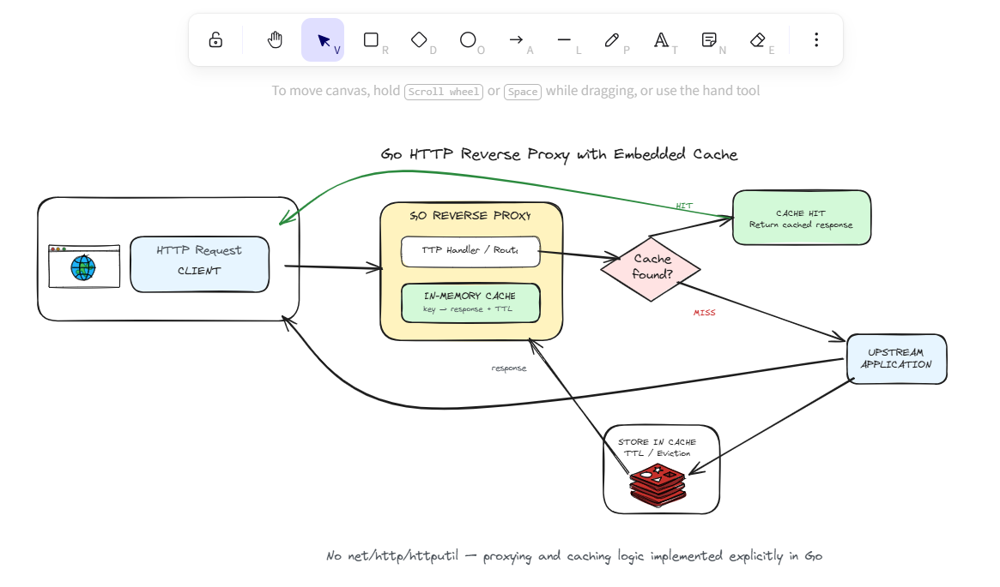

# proxygo

A small HTTP reverse proxy in Go, with a cache built in. No `net/http/httputil` — the request parsing, forwarding, and response relaying is all hand-rolled over raw TCP connections.



## What it does

- Listens on `:8080`, reads raw HTTP requests off the connection
- Forwards them to whatever upstream you point it at
- Caches `GET` responses (only the `200`s) in memory for a bit, so repeat requests don't hit upstream again
- Logs whether each request was a cache hit or miss
- Comes with a tiny dummy upstream server so you can try the whole thing without setting anything else up

## Running it

Needs Go 1.25+.

```bash
git clone https://github.com/prasadf18/proxygo.git
cd proxygo
go build ./...
```

Start the dummy upstream in one terminal:
```bash
go run ./cmd/dummy-upstream
```

Start the proxy in another:
```bash
go run ./cmd/proxygo -target localhost:9000 -cache-ttl 30s
```

Then hit it twice and watch the logs:
```bash
curl -i http://localhost:8080/
curl -i http://localhost:8080/
```
First one's a MISS, second one's a HIT.

Flags:
- `-target` — upstream address (default `localhost:9000`)
- `-cache-ttl` — how long a cached entry stays valid (default `30s`)

Tests:
```bash
go test ./...
```

## Layout

```
cmd/proxygo/        main entrypoint
cmd/dummy-upstream/ throwaway upstream server for testing
internal/proxy/      the actual proxy logic
internal/cache/       the cache
```

## A few notes on how it's built

The cache is keyed on `method + URL`. Works fine as long as there's one fixed upstream — if this ever needed to support multiple targets, the target would need to be part of the key too.

Only `GET` + `200` gets cached. Everything else just passes through.

Responses get fully buffered into memory before going to the client (so they can be cached at the same time). Fine for small stuff, not great for anything huge or streamed.

## What's not done

- No eviction — the cache just grows until entries expire on their own via TTL. A real version would cap the size and evict something (probably LRU).
- No timeouts on the upstream connection, so a hung upstream would hang the request.
- Doesn't look at `Cache-Control` or `Vary` headers, it's purely time-based.

Ran out of time to get to these, but figured it's better to be upfront about them than pretend they're handled.
